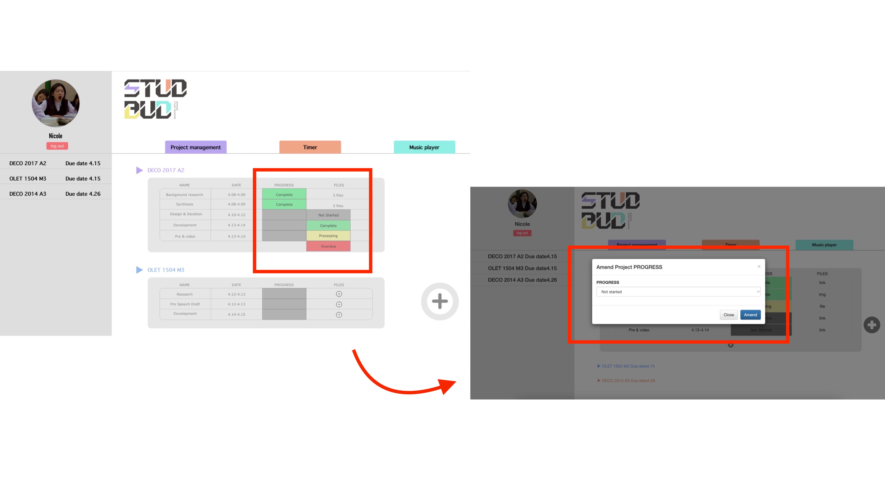

# Yantong LIU yliu0095 500034457

**For this Web App Prototype, it works with Mac Pro (13-inch)(1427 ✖️ 732) on PC and iPhone 12 Pro (414 ✖️ 736) on mobile.**

# What is STUDBUD?
>**STUDBUD** is an app that helps students to study more effectively, and prior thinking and planning are essential for productive learning. The main features of STUDBUD are Project Management, Timer and Music Player.
***Project Management*** is divided into Daily To-do and Project.Daily To-do helps users to plan the specific tasks for each day.Project helps users to plan the completion time and progress of each part of the assignment and add relevant information to the back of each part.
The ***timer*** is divided into countdown, stopwatch and pomodoro timer. countdown allows the user to set a certain amount of time and count down, while stopwatch allows the timer to count up. Pomodoro timer is a learning method that helps users focus. It effectively improves learning efficiency by providing time for study and rest. (Default times = 25 mins on, 5 mins off (x4) then 30 mins break)
The ***Music Player*** will play music or white noise to help the user relax and concentrate.


# Design Principles
1. In the task box, **rectangles with rounded corners** have been used. It makes the user feel friendly and soft.
1. A uniform colour scheme for all pages and a **uniform font and font size** give the whole page a more complete look.
1. **White space** on both sides of the page makes the content more visible and helps the user to concentrate.


# Iterations
> 
* In the initial design, the excessively long task form filled the entire screen. This was not user-friendly. Therefore in the final design the size of the task table was reduced and the size of the table changed depending on the number of tasks.
```
```
 
* In the initial design I did not take into account how users should add new tasks. In the final design, new buttons and forms have been added to improve the user's sense of usability and make the app more functional.
```
```

* In the initial design, the user can change an existing process by clicking on the button pop-up box under the process. After deeper research, I found that although this was easier and more aesthetically pleasing, but once clicked the selection was made directly. I believe this is not good and more steps should be added to reduce user mis-touching. So, in the final design, I changed the design of the page, added a new form to change the process and had a confirmation button before adding it to help reduce user error.
```
```

* In the initial design, the music player section lacks a music playlist. In the final design, I have added a music playlist to help the user know exactly what music should be played next. I also added the element that the music image will rotate when the music is playing, to differentiate between playing and pausing in a more visual way.
```
```

# Reflection
>In this assessment, some iterations have been made based on user usage to better serve the users. Project management priorities have been more clearly highlighted based on feedback from teachers in A2. Added more detail to this assignment.


# Reference
* Music: Brenna, P. (2022). Free Music. Retrieved 20 May 2022, from https://soundcloud.com/fm_freemusic
* icon: iconfont. (2022). Retrieved 14 May 2022, from https://www.iconfont.cn/